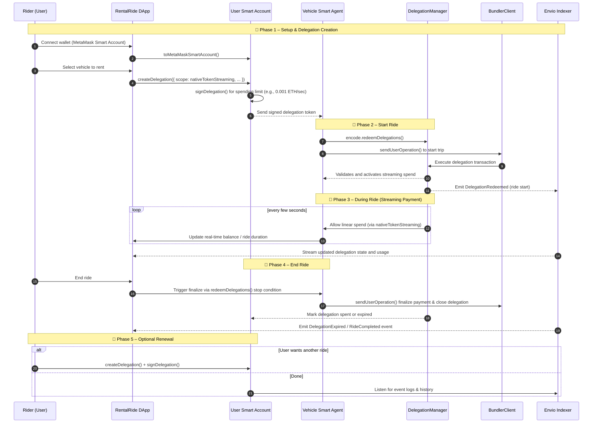

```mermaid
sequenceDiagram
    autonumber

    participant User as Rider (User)
    participant RentalApp as RentalRide DApp
    participant Delegator as User Smart Account
    participant Delegate as Vehicle Smart Agent
    participant DelegationMgr as DelegationManager
    participant Bundler as BundlerClient
    participant Envio as Envio Indexer

    %% ---------------------------
    Note over User,Envio: 🚦 Phase 1 – Setup & Delegation Creation
    User->>RentalApp: Connect wallet (MetaMask Smart Account)
    RentalApp->>Delegator: toMetaMaskSmartAccount()
    User->>RentalApp: Select vehicle to rent
    RentalApp->>Delegator: createDelegation({ scope: nativeTokenStreaming, ... })
    Delegator->>Delegator: signDelegation() for spending limit (e.g., 0.001 ETH/sec)
    Delegator-->>Delegate: Send signed delegation token

    %% ---------------------------
    Note over Delegate,DelegationMgr: 🏁 Phase 2 – Start Ride
    Delegate->>DelegationMgr: encode.redeemDelegations()
    Delegate->>Bundler: sendUserOperation() to start trip
    Bundler->>DelegationMgr: Execute delegation transaction
    DelegationMgr-->>Delegate: Validates and activates streaming spend
    DelegationMgr-->>Envio: Emit DelegationRedeemed (ride start)

    %% ---------------------------
    Note over Delegate,DelegationMgr: 🚴 Phase 3 – During Ride (Streaming Payment)
    loop every few seconds
        DelegationMgr->>Delegate: Allow linear spend (via nativeTokenStreaming)
        Delegate->>RentalApp: Update real-time balance / ride duration
    end
    Envio-->>RentalApp: Stream updated delegation state and usage

    %% ---------------------------
    Note over Delegate,Delegator: 🏁 Phase 4 – End Ride
    User->>RentalApp: End ride
    RentalApp->>Delegate: Trigger finalize via redeemDelegations() stop condition
    Delegate->>Bundler: sendUserOperation() finalize payment & close delegation
    DelegationMgr-->>Delegator: Mark delegation spent or expired
    Envio-->>RentalApp: Emit DelegationExpired / RideCompleted event

    %% ---------------------------
    Note over Delegator,User: 🔁 Phase 5 – Optional Renewal
    alt User wants another ride
        User->>Delegator: createDelegation() + signDelegation()
    else Done
        Delegator->>Envio: Listen for event logs & history
    end

```