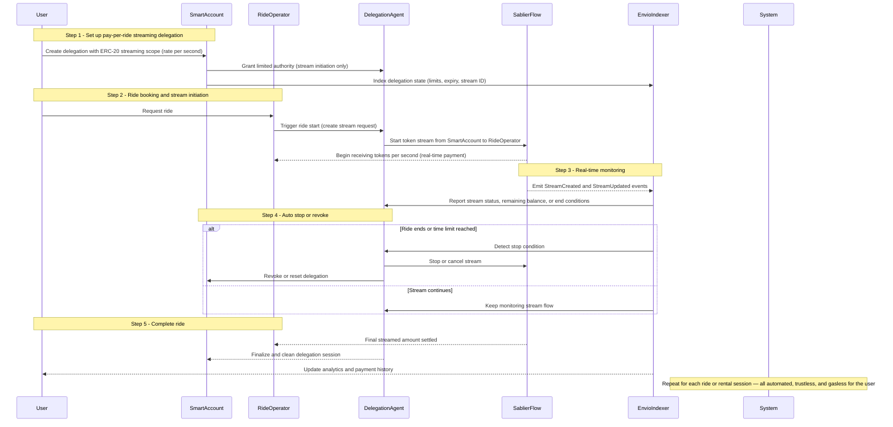

```mermaid
sequenceDiagram
    participant User
    participant SmartAccount
    participant RideOperator
    participant DelegationAgent
    participant SablierFlow
    participant EnvioIndexer

    Note over User,SmartAccount: Step 1 - Set up pay-per-ride streaming delegation
    User->>SmartAccount: Create delegation with ERC-20 streaming scope (rate per second)
    SmartAccount->>DelegationAgent: Grant limited authority (stream initiation only)
    SmartAccount->>EnvioIndexer: Index delegation state (limits, expiry, stream ID)

    Note over User,RideOperator: Step 2 - Ride booking and stream initiation
    User->>RideOperator: Request ride
    RideOperator->>DelegationAgent: Trigger ride start (create stream request)
    DelegationAgent->>SablierFlow: Start token stream from SmartAccount to RideOperator
    SablierFlow-->>RideOperator: Begin receiving tokens per second (real-time payment)

    Note over SablierFlow,EnvioIndexer: Step 3 - Real-time monitoring
    SablierFlow-->>EnvioIndexer: Emit StreamCreated and StreamUpdated events
    EnvioIndexer->>DelegationAgent: Report stream status, remaining balance, or end conditions

    Note over DelegationAgent,SmartAccount: Step 4 - Auto stop or revoke
    alt Ride ends or time limit reached
        EnvioIndexer->>DelegationAgent: Detect stop condition
        DelegationAgent->>SablierFlow: Stop or cancel stream
        DelegationAgent->>SmartAccount: Revoke or reset delegation
    else Stream continues
        EnvioIndexer->>DelegationAgent: Keep monitoring stream flow
    end

    Note over User,RideOperator: Step 5 - Complete ride
    SablierFlow-->>RideOperator: Final streamed amount settled
    DelegationAgent-->>SmartAccount: Finalize and clean delegation session
    EnvioIndexer-->>User: Update analytics and payment history

    Note over System: Repeat for each ride or rental session — all automated, trustless, and gasless for the user
```